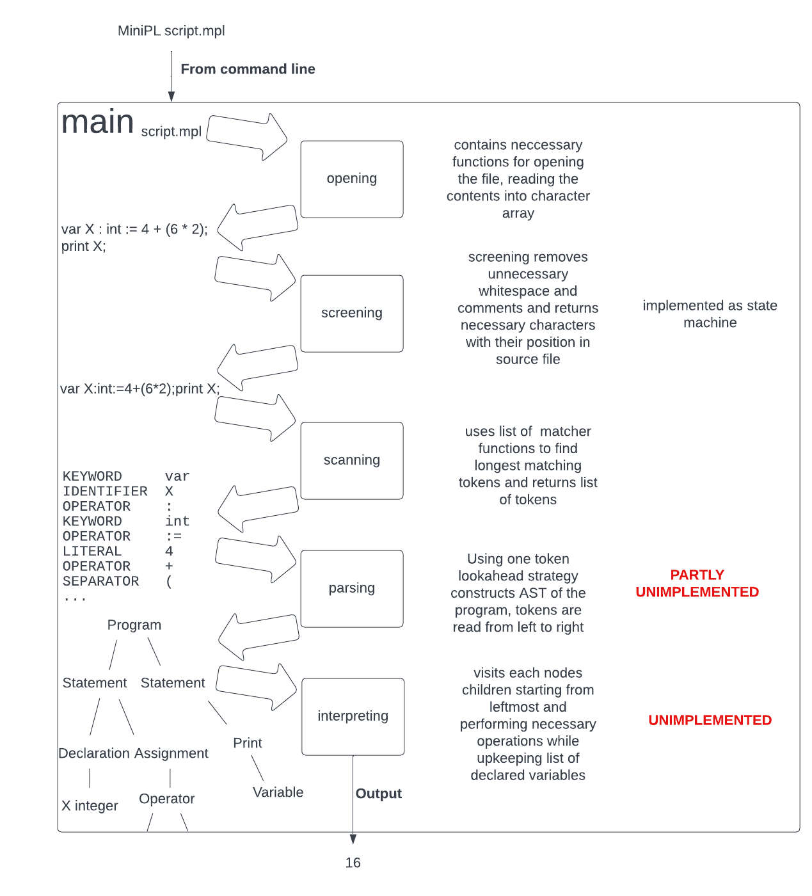

# Joakim Joensuu - Compilers - MiniPL interpreter - 12.3.2023

## Time tracking

| Date  | Hours |     What?                                               |
|-------|-------|---------------------------------------------------------|
| 26.1. |  4,5  | Screener initial statemachine                           |
| 27.1. |  2,5  | More states                                             |
| 2.3.  |   5   | Rest of the states                                      |
| 3.3.  |   8   | Fix screener bugs                                       |
| 4.3.  |   8   | Simplify screener state machine                         |
| 8.3.  |   8   | Change character storing structure                      |
| 20.3. |   8   | FIx found bugs                                          |
| 25.2. |   6   | Start doing scanner tokenizer                           |
| 26.2. |   6   | Finish tokenizer                                        |
| 28.2. |  0,5  | Add separate delimiter token                            |
| 8.6.  |   6   | Initial plan for parser                                 |
| 9.6.  |   4   | Implement parser for declaration                        |
| 12.6. |   5   | Parser for assignment, expressions and print statement  |
| 12.6. |   3   | Documentation                                           |
| Total |  74,5 |                                                         |
## Architecture

 

Different stages of the interpreter process the whole input from earlier stage before outputting it to the next.

## How to use

Clone git repository and cd into it
```
$ git clone https://github.com/JoakimJoensuu/en-voi-laittaa-tollasta.git
$ cd en-voi-laittaa-tollasta/
```

Build and run with example program

```
$ make build
$ ./build/MiniPL test_programs/int_print.mpl
```

Since the interpreter is not fully implemented it will print out screened input, tokens and abstract syntax tree.

## Bugs, missing features and improvements

 - Last part of the interpreter where the execution happens is not implemented
 - Parser is implemented only for declaration of integer variables and print statement.
 - Extra separators are not allowed, `var nTimes : int := 0;;;;;`
 - Parser doesn't use `path/to/file.mpl:<line_number>:<row_number>` format when reporting errors
 - Interpreter works, screen all, scan all, parse all, interpret all, manner instead of each step requesting smallest possible piece of information from previous step at each time
 - Subroutines should emit errors back to main routine where the error should be handled, instead of subroutine exiting the whole program
 - If error is encountered parsing should be continued in order to notify users of possible multiple errors
 - Underscores are not supported in identifier names
 - If parser expects more tokens when the token list is already fully consumed it will try to read more tokens, container for tokens usually has some extra allocated memory, but there is possibility for reading outside the memory area

## Token patterns as regular expressions

Keywords: `(int|else|var|for|if|in|do|string|bool|assert|end|read|print)`

Identifiers: `(?!^(int|else|var|for|if|in|do|string|bool|assert|end|read|print)$)(^.*$)`

Literal: `(([0-9]+)|("[a-zA-Z]*"))`

Operator: `(\+|-|\*|\/|&|!|=|<|>|:|.|...|:=)`

Separator: `(;|\(|\))`

Delimiter: `( )`

## Error handling

If error happens the program exits immediately with an error message. Depending on whether the error was caused by unimplemented feature the error message tells what is still unimplemented or what was wrong with the input file.

`Parsing read is not yet implemented.`

Screener will complain about characters that are not allowed, like some unprintable characters: `Unimplemented character '' code: 0x01 at line 1, column 1`

Scanner will tell about illegal words, like ones having letters in between the numbers: `Error: Invalid integer constant starting at line 1, column 5!`

Parser will inform user of what was expected: `Expected separator ";" at line 2, column 1, got KEYWORD "print"`

## AST

```
var X : int := 4 + (6 * 2);
print X;
```

For this program the AST has following form:

```
                      PROGRAM
                     /       \
                    /         \
                   /           \
                  /             \
                 /               \
                /                 \
               /                   \
          STATEMENT             STATEMENT
         /         \                 \
 DECLARATION        ASSIGNMENT      PRINT
 {type: integer,    {"X"}              \
  name: "X"}            |            VARIABLE
                    OPERATOR         {"X"}
                    {+}     \
                   /         \
          INTEGER_LITERAL    OPERATOR
          {value: 4}         {*}
                            /         \
                   INTEGER_LITERAL  INTEGER_LITERAL
                   {value: 6}       {value: 2}
```

Each node consists of following struct:

```
typedef struct node {
    node_type     type;
    int           children_count;
    int           children_size;
    struct node** children;
    void*         data;
    int           data_size;
} node;
```

Each node can contain extra information, like variable names or operation types in `data` field. Interpretation of `data` and operation done by interpreter is based on node_type enum.
